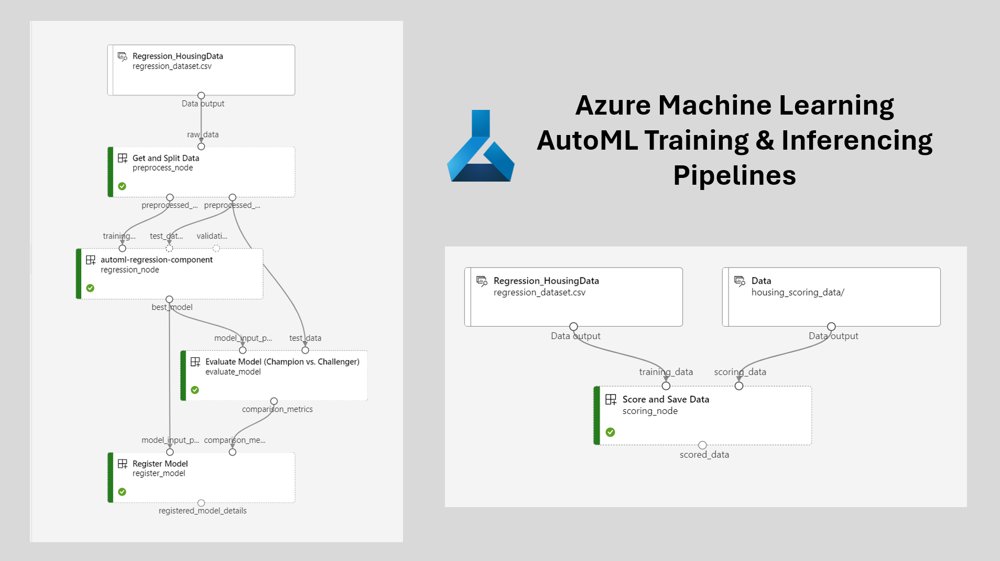

# Azure Machine Learning - AutoML Pipeline Sample with Local Explanations

Contained within this repository is a set of notebooks designed to perform the following operations:

- Load data into an Azure ML-linked blob storage account in CSV format
- Register loaded CSVs as AML Datasets for streamlined consumption in training/inferencing operations
- Train a custom regression model using AutoML
- Evaluate newly trained models against an existing "champion" model against a consistent hold out dataset - the "challenger" is registered if it performs better
- Score data using the model loaded from a CSV in blob storage
- Compute local explanations for each model prediction and append these to an output dataset which is saved into blob storage

There are three notebooks within this repo that are numbered and should be run in sequence. Notebooks 02/03 contain definitions for training and inferencing pipelines, respectively which handle all training and scoring operations and both read and write to and from Azure Blob Storage.

### Getting Started

To execute the notebooks within this repository, you will need to have access to an Azure Machine Learning workspace. Moreover, it is highly recommended that you load and run these notebooks from an AML Compute Instance using the `Python 3.10 - SDK v2` kernel.

### Adapting and Extending

These notebooks were put together for illustration purposes and they are intended to be adapted. You can readily swap in your own datasets by updating the configuration settings within each pipeline definition (see the 02a/03a notebooks). You can easily tap into data which has been preloaded into your Azure ML datastore for training and scoring with custom AutoML models.